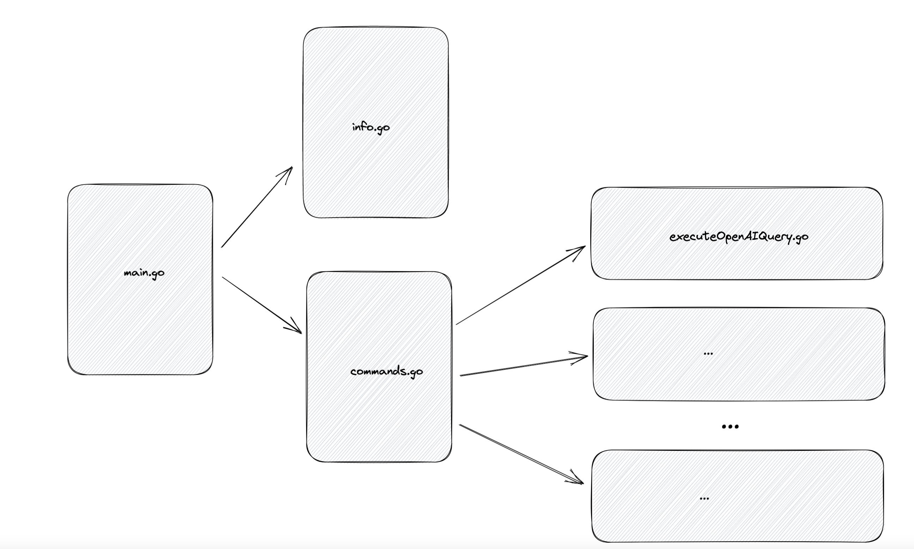

# Vallese-CLI

CLI with low-dependency libraries that does a few cool stuff.

## Requirements

- Go engine
- That's it

## Code arch

The main arch is supposed to be a three layer library separated in the following order:

## Commands
Here are a few cool commands developed, feel free to develop more.

### Open Ai ask
Command that asks question to open arch, it is necessary to have a open ai token to use.

## TO DO
- Tests 
- Output layer to dynamic handle output commands dynamically